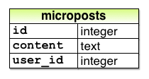
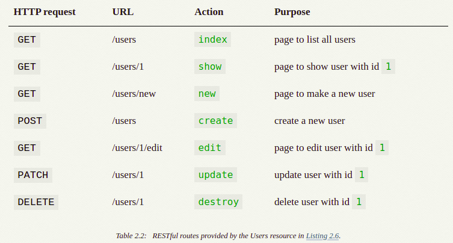

# Rails

https://www.railstutorial.org/book/toy_app

## Scaffolding: Quicker, easier, more seductive

- Ngăn cài đặt Gem từ production 
    bundle config set --local without production

### Data model

#### User model 

- Table user

    

#### Micropost model 

- Table micropost

    

#### The user resource :

- scaffold

    <pre>$ rails generate scaffold User name:string email:string </pre>
> Create db/migrate  
> Create model user 
> Create router : resources (7 method)  
> Create users_controller 
> Create views users 
> Create helpers users_helps 
> Create assets/stylesheets/*.css 

   <pre>$ rails db: migrate</pre>
 - Migrating the database.

#### MVC 

- Model controller view

    

Dưới đây là tóm tắt các bước được hiển thị trong Hình  2.12 :

- Trình duyệt đưa ra yêu cầu đối với URL / users.
- Rails định tuyến / người dùng đến indexhành động trong bộ điều khiển Người dùng.
- Các indexhành động yêu cầu mô hình tài khoản để lấy tất cả người dùng ( User.all).
- Mô hình Người dùng lấy tất cả người dùng từ cơ sở dữ liệu.
- Mô hình Người dùng trả về danh sách người dùng cho bộ điều khiển.
- Bộ điều khiển nắm bắt người dùng trong @usersbiến, biến này được chuyển đến indexchế độ xem.
- Chế độ xem sử dụng Ruby được nhúng để hiển thị trang dưới dạng HTML.
- Bộ điều khiển chuyển HTML trở lại trình duyệt. 4

Representational State Transfer.

    

