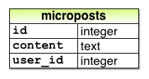

# Rails

https://www.railstutorial.org/book/toy_app

## 2_a toy app

- Scaffolding: Quicker, easier, more seductive

- Ngăn cài đặt Gem từ production 
    <pre>bundle config set --local without production</pre>

### 2.2_Data model

#### User model 

- Table user

    

#### Micropost model 

- Table micropost

    

#### The user resource :

- scaffold

    <pre>$ rails generate scaffold User name:string email:string </pre>
> Create db/migrate  
> Create model user 
> Create router : resources (7 method)  
> Create users_controller 
> Create views users 
> Create helpers users_helps 
> Create assets/stylesheets/*.css 

   <pre>$ rails db: migrate</pre>
 - Migrating the database.

#### MVC 

- Model controller view

    

Dưới đây là tóm tắt các bước được hiển thị trong Hình  2.12 :

- Trình duyệt đưa ra yêu cầu đối với URL / users.
- Rails định tuyến / người dùng đến indexhành động trong bộ điều khiển Người dùng.
- Các indexhành động yêu cầu mô hình tài khoản để lấy tất cả người dùng ( User.all).
- Mô hình Người dùng lấy tất cả người dùng từ cơ sở dữ liệu.
- Mô hình Người dùng trả về danh sách người dùng cho bộ điều khiển.
- Bộ điều khiển nắm bắt người dùng trong @usersbiến, biến này được chuyển đến indexchế độ xem.
- Chế độ xem sử dụng Ruby được nhúng để hiển thị trang dưới dạng HTML.
- Bộ điều khiển chuyển HTML trở lại trình duyệt. 4

Representational State Transfer

    

### 2_3 microposts

 Rails generate scaffold
    <pre>$ rails generate scaffold Micropost content:text user_id:integer</pre>

Migrate db
    <pre>$ rails db:migrate</pre>

Valiadate

- Validate user, micropost in app/models/micropost.rb :
    <pre>validates :content, length: { maximum: 140 }</pre>

Associations between different data models

- In app/model/user.rb :  1 user has many post
    <pre>has_many :microposts</pre>
- In app/model/micropost.rb :  1 post belong to one user
    <pre> belongs_to :user</pre>

rails console
    <pre>
    $ rails console
        User.first
        micropost = first_user.microposts.first
        micropost.user
        exit
    </pre>

Adding presence validations to the User model: app/models/user.rb 
    <pre> validates :name, presence: true </pre>
    
Inheritance hierarchies: 
     

### What we learned in this chapter

- Scaffold tự động tạo mã để mô hình hóa dữ liệu và tương tác với nó thông qua web.
- Scaffold tốt để bắt đầu nhanh chóng nhưng không tốt cho sự hiểu biết.
- Rails sử dụng mẫu Model-View-Controller (MVC) để cấu trúc các ứng dụng web.
- Như được diễn giải bởi Rails, kiến ​​trúc REST bao gồm một tập hợp tiêu chuẩn gồm các URL và các hành động của bộ điều khiển để tương tác với các mô hình dữ liệu.(resources:7 method, resource:6 method)
- Rails hỗ trợ xác thực dữ liệu để đặt các ràng buộc đối với giá trị của các thuộc tính mô hình dữ liệu.(validate)
- Rails đi kèm với các chức năng tích hợp để xác định mối liên kết giữa các mô hình dữ liệu khác nhau.(has_many/belongs_to)
- Chúng ta có thể tương tác với các ứng dụng Rails tại dòng lệnh bằng bảng điều khiển Rails. (rails console)

